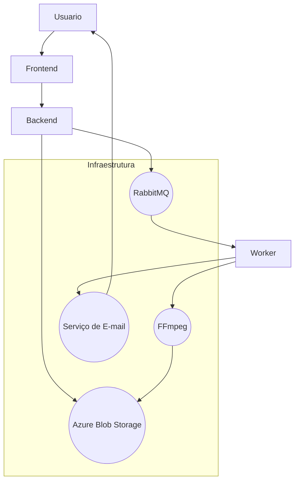

# Conversor de Vídeo

[](https://www.docker.com/) [](https://nodejs.org/)

## Visão Geral do Projeto
Este projeto é um conversor de vídeos que permite aos usuários fazer upload de arquivos, convertê-los para diferentes formatos (MP3, MP4, AVI, WAV) e receber um link para download por e-mail. O sistema é escalável, utilizando RabbitMQ para gerenciar filas de processamento, Azure Blob Storage para armazenar os arquivos e Docker para conteinerização.

## Tecnologias Utilizadas
- **Node.js**
- **Next.js/React**
- **RabbitMQ**
- **Azure Blob Storage**
- **Docker**
- **FFmpeg**

## Setup do Ambiente
### Requisitos:
- Node.js (v14+)
- Docker e Docker Compose
- Conta no Azure Blob Storage
- Servidor RabbitMQ
- Conta de e-mail para envio de notificações (SMTP)

### Passos para Configuração:
1. Clone o repositório:
   ```bash
   git clone https://github.com/seu-usuario/Conversor-de-Video-SD-IFPE.git

   Abra dois terminais um para acessar o Back-end e outro para acessar o Front-end
   cd backend-conversor (Para acessar o backend)
             &
   cd front-conversor (Para acessar o front-end)

   ```

2. Crie um arquivo `.env` na raiz do back-end com as seguintes variáveis:
   ```env
   AZURE_STORAGE_ACCOUNT_NAME=<sua-conta-azure>
   AZURE_STORAGE_CONNECTION_STRING=<sua-chave-azure>
   AZURE_STORAGE_ACCOUNT_KEY=<sua-chave-azure>
   AZURE_STORAGE_CONTAINER_NAME=<nome-do-container>
   RABBITMQ_HOST=<host-do-rabbitmq>
   SENHAGMAIL=<sua-senha-ou-senha-app>
   NODE_ENV=development
   PORT=4000
   ```

3. Instale as dependências em ambos os terminais:
   ```bash
   npm install
   ```

4. Rode o Docker no terminal que está na pasta do Back-end:
   ```bash
   docker-compose up --build
   ```
5. Rode o Front-end no terminal:
   ```bash
   npm run dev
   ```

## Estrutura do Projeto
```
/backend-conversor
├── src
│   ├── config         # Configurações (Azure, RabbitMQ, Logger, Multer)
│   ├── middleware     # Middlewares (Erros, Upload)
│   ├── routes         # Rotas da API
│   ├── services       # Serviços (Conversão, Azure, Email, Fila)
│   └── utils          # Utilitários (FFmpeg, Limpeza de arquivos)
│
├── nginx              # Configuração do Nginx para balanceamento
├── worker.js          # Worker para processamento de fila
├── index.js           # Inicializa o servidor 
├── .env               # Variáveis de ambiente
├── docker-compose.yml # Configuração do Docker
├── Dockerfile         # Configuração do Dockerfile
└── package.json       # Dependências do projeto
```

## Funcionamento do Backend e Worker

### Upload e Conversão:
1. **Upload de Arquivo:** O endpoint `/upload` aceita o arquivo e dados adicionais (formato de saída, e-mail).
2. **Armazenamento:** O arquivo é enviado para o Azure Blob Storage.
3. **Enfileiramento:** Um job é criado na fila do RabbitMQ.
4. **Processamento:** O `worker.js` consome a fila e processa a conversão usando o FFmpeg.
5. **Envio de E-mail:** Após a conversão, o link para download é enviado por e-mail.

### Exemplo de Chamada para Upload:
```bash
curl -F "file=@/caminho/para/seu-video.mp4" -F "outputFormat=mp3" -F "email=seuemail@exemplo.com" http://localhost:3000/upload
```

## Integração com o Front-End
O front-end é construído com Next.js/React. A comunicação com a API é feita através de chamadas HTTP para o endpoint `/upload` e para obter o status dos arquivos.

### Exemplo de Integração (React):
```javascript
async function uploadFile(file, outputFormat, email) {
  const formData = new FormData();
  formData.append('file', file);
  formData.append('outputFormat', outputFormat);
  formData.append('email', email);

  const response = await fetch('/api/upload', {
    method: 'POST',
    body: formData,
  });
  const data = await response.json();
  return data;
}
```

## Instruções para Deploy
1. **Build dos Containers:**
   ```bash
   docker-compose build
   ```
2. **Start dos Containers:**
   ```bash
   docker-compose up -d
   ```
3. **Acompanhar Logs:**
   ```bash
   docker-compose logs -f
   ```

## Diagrama de Arquitetura



1. **Usuário** faz o upload do arquivo via Front-End (Next.js/React).
2. O **Backend (Node.js)** recebe o arquivo e envia para o **Azure Blob Storage**.
3. Um job é enfileirado no **RabbitMQ**.
4. O **Worker** consome a fila, processa o arquivo com **FFmpeg** e reenvia para o Azure.
5. O **E-mail** com o link de download é enviado ao usuário.

## Contribuição
Sinta-se à vontade para abrir issues ou pull requests para melhorar o projeto!

## Licença
[MIT](LICENSE)

---

🚀 **Pronto para converter seus vídeos com eficiência e escalabilidade!**

